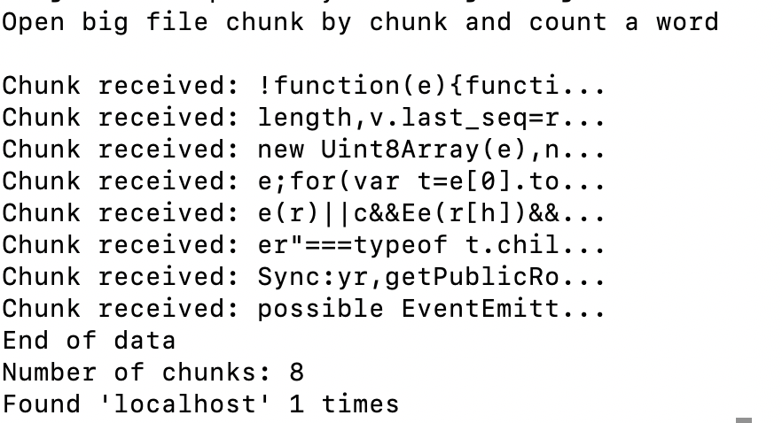

## Instructions for students:

### Find the Word

Create index.js and require filesystem, use createReadStream to open the readme.txt from this repository.
Make sure you separate the data in chunks, then find the word 'localhost'.

-   Images for reference:
    

run this file with node index.js

**Bonus**

-   Count the number of times the word is found.

### Rules

-   This is an individual assignment.
-   Deadline: 30 minutes.
-   Use **Git properly**
